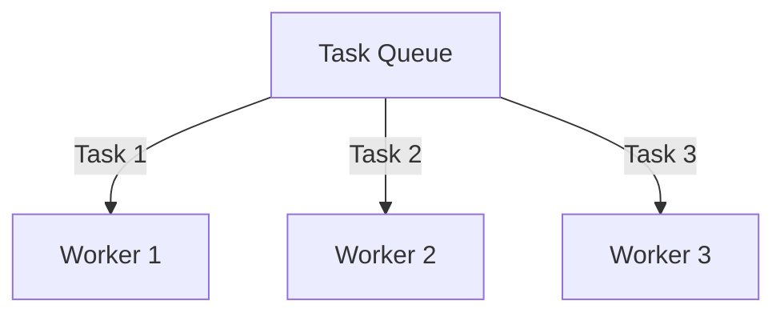

# Core Concepts: Workflows, Activities & Workers

Workflows provides a robust framework for building distributed applications through three key components that work together seamlessly.

## 1. Workflows: The Brains of Your Application

Workflows define the high-level business logic and coordination of your application.

```python
@workflows.workflow.define(workflow_name="data_pipeline")
class DataProcessingWorkflow:
    @workflows.workflow.entrypoint
    async def run(self, raw_data: str) -> dict:
        # Parallel execution using asyncio.gather
        cleaned_data_result = await clean_data(raw_data)

        # Run activities in parallel
        analysis_result, transformed_data = await asyncio.gather(
            analyze_data(cleaned_data_result),
            transform_data(cleaned_data_result),
        )

        # For large-scale parallel processing, use the concurrency framework
        # [Learn more about concurrency patterns](../guides/concurrency.mdx)

        return await generate_report(analysis_result, transformed_data)
```

Key characteristics:

- Deterministic execution (same inputs → same outputs)
- Long-running (can execute for years with checkpointing)
- Stateful coordination
- Input/output limited to 2MB
- **A workflow will timeout if the delay between activities is more than 2 seconds**

Workflows should contain only orchestration logic - they decide what needs to happen and in what order, but never perform actual work directly.

## 2. Activities: The Workhorses

Activities perform the actual work in your application.

```python
@workflows.activity()
async def clean_data(raw_data: str) -> dict:
    """Remove noise and normalize data format"""
    # Implementation details...
```

Key characteristics:

- Isolated execution in separate processes
- Automatic retries on failure
- Input/output limited to 2MB
- Idempotent by design (safe to retry)
- Focused on single responsibilities

## 3. Workers: The Execution Engines

Workers execute workflows and activities. They form the scalable execution layer.

```python
async def main():
    await workflows.run_worker([
        DataProcessingWorkflow,
        clean_data,
        analyze_data,
        transform_data,
        generate_report
    ])
```

### Getting Started: One Worker, One Workspace

**For most development and testing, create a dedicated workspace in the [Mistral Console](https://console.mistral.ai/) and run a single worker:**

```bash
MISTRAL_API_KEY=your_workspace_key uv run python my_workflow.py
```

This is the recommended approach for:
- Learning and experimenting
- Local development
- Simple production workloads

### Scaling with Multiple Workers

When you need more throughput or want to test different code simultaneously, you can run multiple workers. Here are the common patterns:

> **What is a task queue?** A task queue is a lightweight routing mechanism that determines which workers can execute which workflows and activities. Workers poll specific task queues for work, and workflows/activities are assigned to task queues when executed. [Learn more about task queues](https://docs.temporal.io/task-queue).



**Pattern 1: Horizontal Scaling (Same code, more capacity)**
- Multiple workers running identical code
- Same namespace (same API key)
- Same task queue
- Tasks distributed automatically
- Use case: Production workloads needing more throughput

```bash
# Worker 1, 2, 3... all identical
MISTRAL_API_KEY=prod_key uv run python my_workflow.py
```

**Pattern 2: Environment Separation (Dev/Staging/Prod)**
- Different workspaces for different environments
- Each environment gets its own namespace
- Complete isolation between environments

```bash
# Dev workspace
MISTRAL_API_KEY=dev_workspace_key uv run python my_workflow.py

# Prod workspace
MISTRAL_API_KEY=prod_workspace_key uv run python my_workflow.py
```

**Pattern 3: Testing Different Code (Same workspace)**
- Same workspace (same namespace)
- Different task queues for isolation
- Use case: Testing changes without affecting running workers

```bash
# Stable version
MISTRAL_API_KEY=workspace_key uv run python my_workflow.py

# Testing changes
TEMPORAL_TASK_QUEUE=testing MISTRAL_API_KEY=workspace_key uv run python my_workflow_v2.py
```

:::danger Critical: Avoid Worker Conflicts

**Namespaces are automatically derived from your API key: `customer_id:workspace_id`**

Workers using the same API key share the same namespace

**What could happen:**
- Version conflicts: Different code versions handling the same workflows
- Unpredictable behavior: Any worker can pick up any task
- Hard to debug: Can't trace which worker executed what

**How to avoid conflicts:**
- For different environments → Use separate workspaces (different namespaces)
- For testing changes → Use different task queues on the same workspace
- For scaling → Use same workspace, same task queue, same code

:::

## Complete Execution Flow

1. Workflow triggered (API/schedule/manual)
2. Task added to queue
3. Available worker pulls task and executes workflow
4. When workflow hits activity:
   - Activity task added to queue
   - Any available worker pulls and executes it
5. Results flow back through the system

## Key Differences

| Component | Responsibility | Execution Location   | Lifetime     | Scaling Impact                           |
| --------- | -------------- | -------------------- | ------------ | ---------------------------------------- |
| Workflow  | Orchestration  | Worker process       | Long-running | More workers = more concurrent workflows |
| Activity  | Actual work    | Any available worker | Short-lived  | More workers = more parallel execution   |
| Worker    | Execution      | Your infrastructure  | Long-running | Horizontal scaling unit                  |
