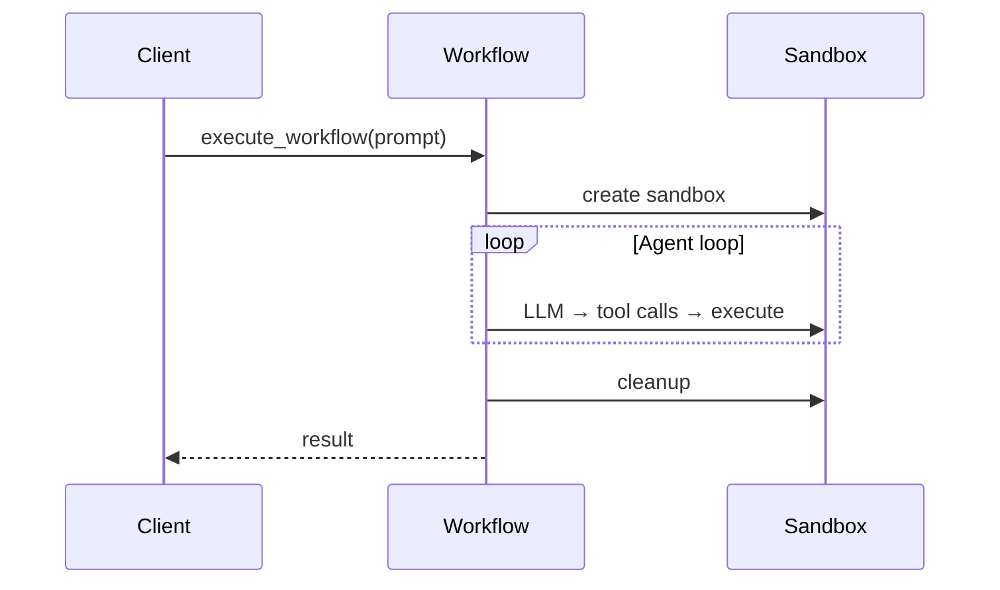

# Nuage Plugin

The Nuage plugin (`mistralai-workflows-plugins-nuage`) orchestrates AI coding agents inside sandboxed containers. It powers Le Chat's "Vibe coding" feature — running an agentic loop where an LLM reasons, invokes tools, and executes code in isolation.

## Overview



**Key features:**
- **Sandboxed execution** — code runs in isolated containers (Demiurge)
- **GitHub integration** — clone repos, create commits/PRs
- **Chat assistant integration** — stream progress to Le Chat UI
- **Extensible** — plug in custom sandboxes, agents, or integrations

## Installation

The Nuage plugin is an internal package published to Gemfury. Configure the Gemfury index and install:

```bash
# Configure Gemfury index (get token from 1Password or team lead)
export UV_INDEX_GEMFURY_PASSWORD="<your-gemfury-token>"

# Add to your project
uv add mistralai-workflows-plugins-nuage --index-strategy unsafe-best-match --prerelease=allow
```

Or add to `pyproject.toml`:

```toml
[project]
dependencies = [
    "mistralai-workflows-plugins-nuage>=0.0.1rc1",
]

[tool.uv]
extra-index-url = ["https://pypi.fury.io/mistralai/"]
prerelease = "allow"
index-strategy = "unsafe-best-match"
```

Then run `uv sync` with the Gemfury token exported.

## Quick Start (Self-Served)

| Environment | Base URL | Chat URL |
|---|---|---|
| **Staging** | `https://api.globalaegis.net` | `https://chat.globalaegis.net` |
| **Prod** | `https://api.mistral.ai` | `https://chat.mistral.ai` |

### Minimal — prompt only

```python
from mistralai_workflows.client import WorkflowsClient
from mistralai_workflows.plugins.nuage.workflow.workflow_models import NuageSandboxWorkflowParams

BASE_URL = "https://api.globalaegis.net"  # staging

async with WorkflowsClient(base_url=BASE_URL, api_key="...") as client:
    result = await client.execute_workflow_and_wait(
        workflow_identifier="__shared-nuage-workflow",
        input_data=NuageSandboxWorkflowParams.model_validate({
            "prompt": "Create a Python CLI that converts CSV to JSON"
        }),
    )
```

### With GitHub + Chat Assistant integrations

```python
import json

from mistralai_workflows.client import WorkflowsClient
from mistralai_workflows.plugins.nuage.crypto import encrypt
from mistralai_workflows.plugins.nuage.workflow.workflow_models import NuageSandboxWorkflowParams

BASE_URL = "https://api.globalaegis.net"  # staging

async with WorkflowsClient(base_url=BASE_URL, api_key="...") as client:
    # 1. Execute workflow
    execution = await client.execute_workflow(
        workflow_identifier="__shared-nuage-workflow",
        input_data=NuageSandboxWorkflowParams.model_validate({
            "prompt": "Add dark mode support to the app",
            "integrations": {
                "github": {"url": "https://github.com/org/repo", "branch": "main"},
                "chat_assistant": {"user_message": "Add dark mode support"},
            },
        }),
    )

    # 2. Secret handshake (required for github/lechat)
    pub_key = await client.query_workflow(execution.execution_id, "get_public_key")
    encrypted = encrypt(
        json.dumps({"github_token": "ghp_xxx", "mistral_api_key": "..."}),
        pub_key.result["public_key"].encode(),
    )
    await client.signal_workflow(execution.execution_id, "secrets", encrypted)

    # 3. Wait for result
    result = await client.wait_for_workflow_completion(execution.execution_id)
```

**Secret handshake** (required when `integrations.github` or `integrations.chat_assistant` is set):
1. Query the workflow's RSA public key (`get_public_key` query)
2. Encrypt secrets JSON with that public key
3. Send encrypted payload via the `secrets` signal
4. Workflow decrypts at runtime — secrets never transit in plain text

## Configuration

### `WorkflowConfig`

| Field | Type | Default | Description |
|---|---|---|---|
| `sandbox` | `Sandbox` | `DemiurgeSandbox()` | Sandbox provider (discriminator: `type`) |
| `agent_session` | `Session` | `VibeSession()` | Agent session provider (discriminator: `type`) |
| `agent` | `Agent` | `VibeAgent()` | Agent configuration (discriminator: `type`) |
| `secrets` | `EncryptedPayload \| None` | `None` | Pre-provided secrets (skips handshake if set) |

### `WorkflowIntegrations`

| Field | Type | Default | Description |
|---|---|---|---|
| `github` | `GitHubParams \| None` | `None` | GitHub integration |
| `chat_assistant` | `ChatAssistantParams \| None` | `None` | Le Chat integration (alias: `lechat`) |

### `GitHubParams`

| Field | Type | Default | Description |
|---|---|---|---|
| `url` | `str` | (required) | Repository URL |
| `branch` | `str \| None` | `None` | Branch to clone |
| `commit` | `str \| None` | `None` | Commit SHA to checkout |
| `teleported_diffs` | `bytes \| None` | `None` | Git diffs to apply after clone |

### `ChatAssistantParams`

| Field | Type | Default | Description |
|---|---|---|---|
| `user_message` | `str \| None` | `None` | Override the default user message (defaults to the prompt if not set) |
| `project_name` | `str \| None` | `None` | Optional project name |

### `DemiurgeSandbox`

| Field | Type | Default | Description |
|---|---|---|---|
| `type` | `Literal["demiurge"]` | `"demiurge"` | Discriminator for polymorphic serialization |
| `config` | `DemiurgeSandboxConfig` | `DemiurgeSandboxConfig()` | Sandbox configuration |

### `DemiurgeSandboxConfig`

| Field | Type | Default | Description |
|---|---|---|---|
| `image` | `str \| None` | `python-alpine-sandbox:v0.0.1-dev25` | Container image |
| `ttl_seconds` | `int` | `600` | Sandbox TTL (60–3600) |
| `setup_script` | `str \| None` | `""` | Script run after container creation |
| `cpu_request` | `str \| None` | `None` | CPU request (e.g., `100m`) |
| `cpu_limit` | `str \| None` | `None` | CPU limit (e.g., `500m`) |
| `memory_request` | `str \| None` | `None` | Memory request (e.g., `128Mi`) |
| `memory_limit` | `str \| None` | `None` | Memory limit (e.g., `512Mi`) |
| `storage_limit` | `str \| None` | `5Gi` | Storage limit (e.g., `1Gi`) |

### `VibeSession`

| Field | Type | Default | Description |
|---|---|---|---|
| `type` | `Literal["vibe"]` | `"vibe"` | Discriminator for polymorphic serialization |
| `teleported_session` | `TeleportSession \| None` | `None` | Teleported session state (for resuming) |

### `VibeAgent`

| Field | Type | Default | Description |
|---|---|---|---|
| `name` | `str` | `vibe-agent` | Agent name |
| `model` | `str` | (inherited from `Agent`) | LLM model name |
| `api_key_env_var` | `str` | `PROD_MISTRAL_API_KEY` | Env var for API key |
| `api_base` | `str` | `https://api.mistral.ai/v1` | API endpoint |
| `auto_approve` | `bool` | `True` | Auto-approve tool calls |
| `temperature` | `float` | `0.2` | Model temperature |
